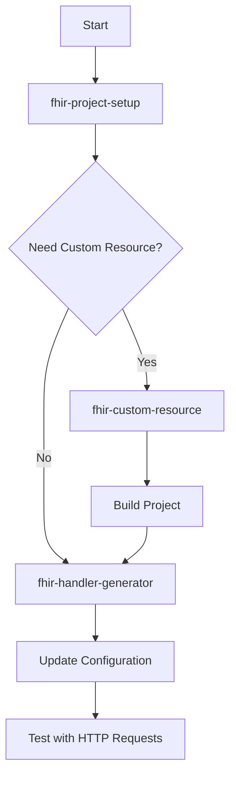

# FHIR Engine Code Generation Skills

Code generation skills for building FHIR APIs faster with FHIR Engine framework.

## Available Code Generation Skills

### 1. fhir-project-setup ⭐ Start Here
**Generates:** Complete FHIR Engine Web API project with configuration

**Use when:**
- Starting a new FHIR API project
- Need to scaffold initial project structure
- Setting up with specific database (PostgreSQL, SQL Server, Cosmos DB)
- Configuring FHIR version (R4, R4B, R5)
- Need .NET Aspire orchestration setup

**Examples:**
- "Create a new FHIR project with PostgreSQL data store"
- "Setup a FHIR Web API with R4B version"
- "I want to create a FHIR R5 project for testing"
- "Initialize a FHIR Engine project with custom data store and SQS logging"

**Triggers:** Questions about creating new projects, setting up FHIR APIs, project scaffolding

**Outputs:**
- Complete project structure with .csproj files
- Solution file with all projects added
- Git repository with initial commit
- appsettings.json and fhirengine.json templates
- Ready-to-build FHIR API

---

### 2. fhir-handler-generator ⭐ Most Used
**Generates:** FHIR Engine handlers (CRUD, custom operations, workflows)

**Use when:**
- Creating CRUD operations for FHIR resources
- Implementing custom operations ($cancel, $validate, etc.)
- Adding validation, enrichment, or audit workflows
- Building handler pipeline logic

**Examples:**
- "Create CRUD handlers for Patient resource"
- "Add a $mark-deceased operation to Patient"
- "Create a PreCRUD validation handler for appointments"

**Triggers:** Questions about creating handlers, implementing FHIR interactions

---

### 3. fhir-custom-resource ⭐ Second Most Used
**Generates:** Custom FHIR resources using code-first POCO approach

**Use when:**
- Creating organization-specific FHIR resources
- Building domain-specific data models
- Extending FHIR with custom resource types
- Need complex nested structures

**Examples:**
- "Create a custom Inventory resource for tracking hospital supplies"
- "Build an Enrollment resource for care program management"
- "Create AlertNotification custom resource"

**Triggers:** Questions about custom resources, new resource types

---

### 4. fhir-custom-datastore ⭐
**Generates:** Custom data stores with relational models

**Use when:**
- Mapping FHIR resources to relational database tables
- Creating custom search services
- Building data mappers for FHIR ↔ Database
- Need fine-grained control over database schema

**Examples:**
- "Create a custom data store for Appointment with relational models"
- "Map Patient resource to SQL database with separate tables for identifiers"
- "Generate data store with custom search for Observation"

**Triggers:** Questions about custom data stores, relational models, database mapping

---

### 5. fhir-structuredefinition ⭐
**Generates:** FHIR StructureDefinition conformance resources

**Use when:**
- Creating FHIR profiles (constraints on existing resources)
- Defining custom extensions
- Adding validation constraints
- Creating formal definitions for custom resources

**Examples:**
- "Create a Singapore Patient profile with NRIC validation"
- "Generate an extension for patient birth time"
- "Create StructureDefinition for custom Inventory resource"

**Triggers:** Questions about StructureDefinitions, profiles, extensions, constraints

---

### 6. fhir-data-mapping (Task) ⭐
**Provides:** Data mapping analysis between custom models and FHIR

**Use when:**
- Analyzing existing database schemas
- Determining appropriate FHIR resources
- Creating field-level mappings
- Understanding transformation requirements

**Examples:**
- "Map this database schema to FHIR resources"
- "What FHIR resource should I use for this data model?"
- "Analyze my legacy system data for FHIR migration"

**Triggers:** Questions about mapping custom data models to FHIR, database schema conversion

---

## Quick Decision Guide

**Question: What should I create?**

```
Starting a new FHIR project?
  → Use fhir-project-setup (First step!)

Need to handle FHIR operations?
  → Use fhir-handler-generator

Need a new custom resource type?
  → Use fhir-custom-resource

Need to analyze/map existing data to FHIR?
  → Use fhir-data-mapping (Task)

Need custom relational database mapping?
  → Use fhir-custom-datastore

Need StructureDefinition/Profile/Extension?
  → Use fhir-structuredefinition
```

## Skill Workflow

### Typical Development Flow



**Example: Starting a New FHIR Project**

1. **Setup Project**
   ```
   "Create a new FHIR project with PostgreSQL document store and R5"
   ```
   → Uses `fhir-project-setup` skill

2. **Build and Verify**
   ```bash
   cd MyFhirApi.R5.DocumentPg
   dotnet build
   dotnet run
   ```

3. **Create Handlers** (next step)
   → Continue with handler generation

---

**Example: Building a Care Program Feature**

1. **Create Custom Resource** (if needed)
   ```
   "Create a custom CareProgram resource with identifier, active, title,
   description, period, and participants"
   ```
   → Uses `fhir-custom-resource` skill

2. **Create Handlers**
   ```
   "Create CRUD handlers for CareProgram resource"
   ```
   → Uses `fhir-handler-generator` skill

3. **Add Validation**
   ```
   "Add PreCRUD handler to validate participants exist before creating CareProgram"
   ```
   → Uses `fhir-handler-generator` skill

4. **Add Notification**
   ```
   "Add PostInteraction handler to send enrollment email after CareProgram creation"
   ```
   → Uses `fhir-handler-generator` skill

## How Skills Work Together

### Scenario 0: Starting from Scratch

**Goal:** Create a new FHIR API project and implement Patient operations

```
1. Ask: "Create a new FHIR project with PostgreSQL data store"
   → fhir-project-setup creates complete project structure

2. Navigate to project and build:
   cd MyFhirApi.R5.DocumentPg
   dotnet build
   dotnet run

3. Ask: "Create CRUD handlers for Patient resource"
   → fhir-handler-generator creates handlers

4. Ask: "Add NRIC validation before creating patients"
   → fhir-handler-generator creates PreInteraction validation handler

5. Test the API:
   - Visit http://localhost:5000/metadata
   - Use generated .http files to test
```

**Result:** Complete FHIR API from zero to running in minutes

---

### Scenario 1: Standard FHIR Resource

**Goal:** Implement Patient CRUD operations with validation

```
1. Ask: "Create CRUD handlers for Patient resource"
   → fhir-handler-generator creates handlers

2. Ask: "Add NRIC validation before creating patients"
   → fhir-handler-generator creates PreInteraction validation handler

3. Ask: "Send welcome email after patient creation"
   → fhir-handler-generator creates PostInteraction notification handler
```

**Result:** Complete Patient implementation with validation and notifications

---

### Scenario 2: Custom Resource with Full Implementation

**Goal:** Create Inventory management system

```
1. Ask: "Create custom Inventory resource with identifier, location, itemType, quantity"
   → fhir-custom-resource creates entity class and configuration

2. Build project to generate StructureDefinition

3. Ask: "Create CRUD handlers for Inventory resource"
   → fhir-handler-generator creates handlers

4. Ask: "Add PreCRUD handler to check if location exists"
   → fhir-handler-generator creates validation handler

5. Ask: "Add PostCRUD handler to update location inventory count"
   → fhir-handler-generator creates update handler
```

**Result:** Complete custom resource with handlers and business logic

---

### Scenario 3: Custom Operation on Standard Resource

**Goal:** Add $cancel operation to Appointment

```
1. Ask: "Create $cancel custom operation for Appointment resource"
   → fhir-handler-generator creates operation handler and OperationDefinition

2. Ask: "Add PostCRUD handler to free up slot when appointment is cancelled"
   → fhir-handler-generator creates slot update handler
```

**Result:** Custom operation with side effects

## Skill Features

### Auto-Generation Features

**fhir-handler-generator:**
- ✅ Complete handler class with dependency injection
- ✅ Exception handling patterns
- ✅ OperationDefinition for custom operations
- ✅ Configuration updates (fhirengine.json)
- ✅ Capability statement updates
- ✅ Sample HTTP requests

**fhir-custom-resource:**
- ✅ Entity class with proper attributes
- ✅ Component classes for nested structures
- ✅ StructureDefinition (via MSBuild)
- ✅ Search parameter definitions
- ✅ Configuration updates
- ✅ Capability statement entry
- ✅ Sample HTTP requests

**fhir-custom-datastore:**
- ✅ DbContext class with proper configuration
- ✅ IResourceEntity models with EF Core attributes
- ✅ Search service implementation
- ✅ Data mapper service (FHIR ↔ Database)
- ✅ Configuration updates
- ✅ Migration-ready entity models

**fhir-structuredefinition:**
- ✅ Complete StructureDefinition JSON
- ✅ Profile definitions with differential elements
- ✅ Extension definitions with proper context
- ✅ Slicing patterns for identifiers
- ✅ FHIRPath validation constraints
- ✅ Sample validation requests

**fhir-data-mapping:**
- ✅ Resource selection recommendations
- ✅ Field-level mapping table
- ✅ Transformation specifications
- ✅ Extension definitions for unmappable fields
- ✅ Sample FHIR instances
- ✅ Implementation considerations

### Quality Assurance

All skills enforce:
- ✅ Framework best practices
- ✅ Naming conventions
- ✅ FHIR R5 compliance (R4B support)
- ✅ Complete error handling
- ✅ Proper configuration
- ✅ Singapore regional context (no US Core)

## Common Patterns

### Pattern 1: CRUD with Validation

```
1. Create CRUD handlers
2. Add PreInteraction format validation
3. Add PreCRUD business validation
4. Add PostInteraction audit logging
```

### Pattern 2: Custom Resource + Handlers

```
1. Create custom resource
2. Build project
3. Create CRUD handlers
4. Add workflow handlers as needed
```

### Pattern 3: Custom Operation with Side Effects

```
1. Create custom operation handler
2. Add PostCRUD handler for related updates
3. Add PostInteraction handler for notifications
```

## Tips for Best Results

### When Asking for Code Generation

**Be Specific:**
✅ "Create a Read handler for Patient resource that checks user permissions"
❌ "Create a handler"

**Provide Context:**
✅ "Create $cancel operation for Appointment that sets status to cancelled and frees the slot"
❌ "Add cancel operation"

**Specify Resource Types:**
✅ "Create CRUD handlers for Observation resource"
❌ "Create CRUD handlers"

### Multi-Step Requests

**Break down complex features:**
```
Instead of: "Create inventory system with validation and notifications"

Ask in steps:
1. "Create custom Inventory resource with these fields..."
2. "Create CRUD handlers for Inventory"
3. "Add validation to check location exists"
4. "Add notification when inventory is low"
```

**Result:** Better code quality and easier to understand

## File Organization

Skills generate files in standard locations:

```
/Handlers/
  PatientCrudFhirHandler.cs            # From fhir-handler-generator
  PatientMarkDeceasedHandler.cs        # From fhir-handler-generator
  PatientValidationHandler.cs          # From fhir-handler-generator

/Data/
  InventoryEntity.cs                   # From fhir-custom-resource

/Conformance/
  operation-patient-mark-deceased.json # From fhir-handler-generator
  Inventory.StructureDefinition.json   # From fhir-custom-resource (via build)

/Sample Requests/
  patient.http                         # From both skills
  inventory.http                       # From fhir-custom-resource
```

## Configuration Files Updated

Both skills update:

**fhirengine.json:**
- Handler class registration
- Custom resource registration
- AcceptedTypes arrays

**capability-statement.json:**
- Resource types
- Supported interactions
- Custom operations
- Search parameters

## Next Steps After Code Generation

1. **Review Generated Code**
   - Understand the patterns
   - Adjust business logic if needed
   - Add additional validation

2. **Build Project**
   ```bash
   dotnet build
   ```

3. **Test with Sample Requests**
   - Use generated .http files
   - Test all CRUD operations
   - Test custom operations

4. **Run Tests**
   - Unit test handlers
   - Integration test workflows
   - Test error scenarios

5. **Deploy**
   - Review configuration
   - Test in staging
   - Deploy to production

## Getting Help

### Handler Questions
- "How do I create a Search handler?"
- "What's the difference between PreCRUD and PostCRUD?"
- "How do I implement conditional updates?"

### Custom Resource Questions
- "What data types can I use?"
- "How do I create nested components?"
- "How do I reference other resources?"

### General Questions
- "What's the handler execution order?"
- "How do exceptions work?"
- "How do I configure search parameters?"

## Related Skills

**Configuration & Troubleshooting:**
- `fhir-config-troubleshooting` - Fix configuration issues
- `fhir-errors-debugger` - Debug runtime errors
- `handler-patterns` - Learn handler patterns

## Skill Maintenance

These skills are kept in sync with FHIR Engine framework updates.

**When framework changes:**
- Skills updated with new patterns
- Examples refreshed
- Best practices revised

**Version compatibility:**
- Skills target FHIR Engine 1.0+
- Support .NET 8.0+
- Compatible with FHIR R4, R4B, and R5
